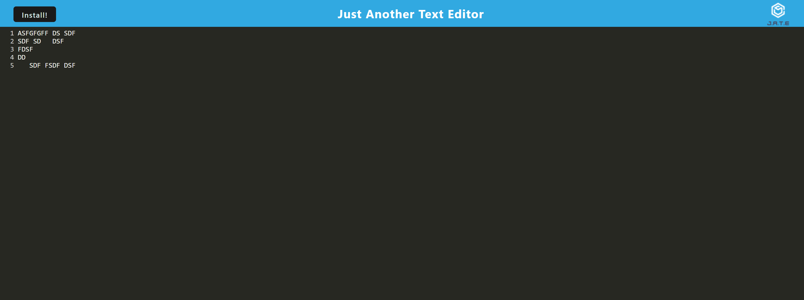

# JATE

JATE is a simple JavaScript-based text editor web application that allows you to create and edit text documents.

# View

Screenshot of working app



## Installation

To set up and run the JATE app on your local machine, follow these steps:

**Clone the Repository:**

   ```bash
   git clone git@github.com:stasbaz/jate.git

   ```
## Link

Link of deployed app - https://blooming-badlands-04464-7c9700d8e417.herokuapp.com/
